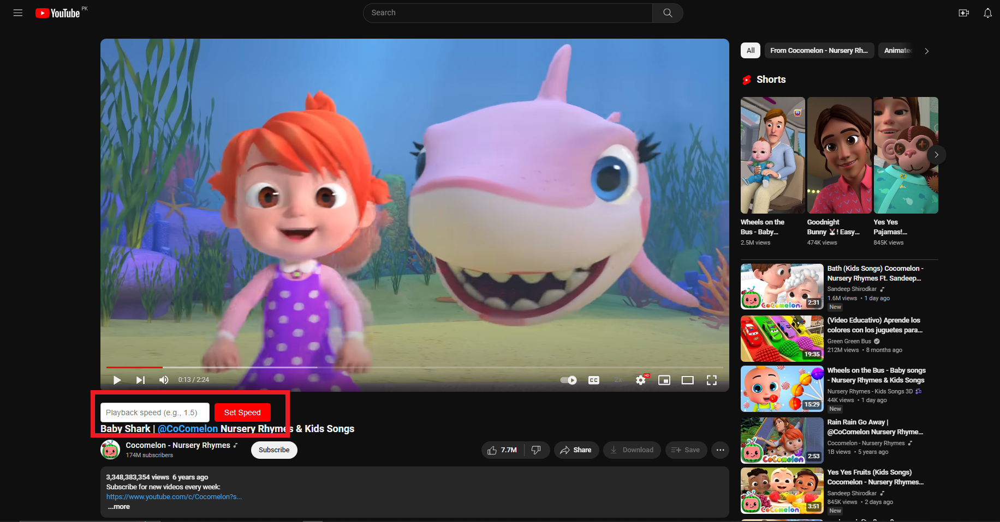

# Manage Youtube Playback Rate

## Overview

This Chrome extension enhances the YouTube playback speed options, allowing you to set custom playback speeds beyond the limitations of the native YouTube options.

## Features

- Adds a custom input field and button to the YouTube interface, enabling you to set playback speeds of your choice.
- Provides greater flexibility for users who want to watch or listen to content at speeds beyond the default options offered by YouTube.

## Screenshots

### 1. Without Speed Options

### 2. With YouTube's Playback Speed Options (Up to 2x)

### 3. With Custom Playback Speed Option

## How to Use/Installation

1. Clone or download this repository.
2. Open Google Chrome.
3. Go to `chrome://extensions/`.
4. Enable Developer mode.
5. Click on "Load unpacked" and select the directory where you cloned/downloaded this repository.
6. Open a YouTube video.
7. Look for the added input field and button in the YouTube interface.
8. Enter your desired playback speed in the input field and click the "Set Speed" button.
9. Enjoy watching or listening to the video at your custom playback speed!

## Disclaimer

This extension modifies the playback speed of YouTube videos, which may affect your viewing or listening experience. Use it responsibly and adjust playback speed according to your preferences.

## Contributing

Contributions are welcome! Feel free to fork this repository and submit pull requests with improvements or new features.
